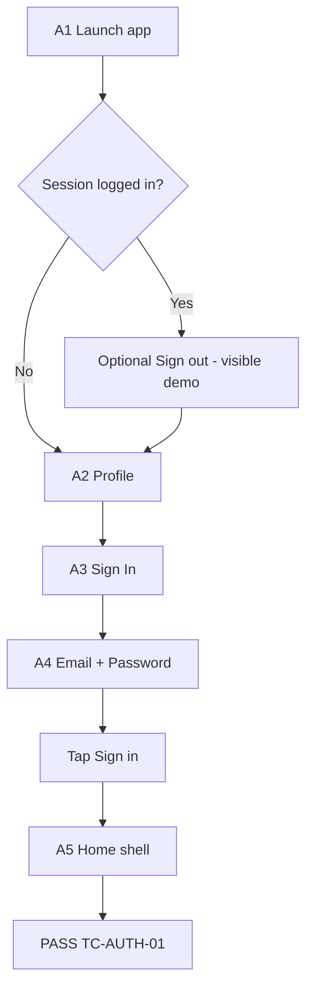
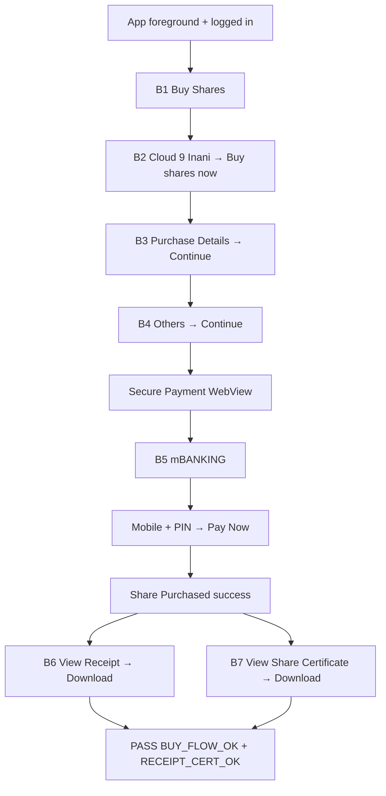

# Aungsha Mobile App — Flow Documentation

> End-to-end **UI automation** flows, test cases, test data, and screen/gateway touchpoints for the Aungsha Android app.

[](#)
[](#)
[](#)
[](#)

| | |
|---|---|
| **Document type** | Flow / Test Design Spec |
| **Application** | Aungsha (`com.aungsha.app`) |
| **App version under test** | `1.0.17` (versionCode `29`) |
| **Automation stack** | Appium 2 · UiAutomator2 · WebdriverIO · Mocha |
| **Primary device** | Emulator `emulator-5554` (AVD: `Aungsha_Emu`) |
| **Document version** | `1.2` |
| **Last updated** | 2026-09-21 |

---

## Run commands (copy-paste)

> Use **`npm.cmd`** on Windows PowerShell (avoids `npx` execution-policy errors).

### 1) Appium (Terminal A — keep running)

```powershell
cd e:\Aungsha-Mobile-App-Test
npm.cmd run appium
```

### 2) Emulator (if not already open)

```powershell
& "$env:LOCALAPPDATA\Android\Sdk\emulator\emulator.exe" -avd Aungsha_Emu
```

### 3) Login test

```powershell
cd e:\Aungsha-Mobile-App-Test
npm.cmd run test:login
```

### 4) Buy flow (Cloud 9 + mBanking + Receipt / Certificate) — one command

```powershell
cd e:\Aungsha-Mobile-App-Test
npm.cmd run test:buy
```

### 5) Buy flow via WDIO wrapper (`src/tests/project-buy-flow.js`)

```powershell
cd e:\Aungsha-Mobile-App-Test
npm.cmd run test:buy:wdio
```

### 6) Direct script (same as `test:buy`)

```powershell
cd e:\Aungsha-Mobile-App-Test
node .\scripts\project-buy-flow.js
```

| Goal | Command |
|------|---------|
| Start Appium | `npm.cmd run appium` |
| Login | `npm.cmd run test:login` |
| Buy + receipt | `npm.cmd run test:buy` |
| Buy via WDIO | `npm.cmd run test:buy:wdio` |

---

## Table of contents

1. [Overview](#1-overview)
2. [Repository structure](#2-repository-structure)
3. [Architecture](#3-architecture)
4. [Scope at a glance](#4-scope-at-a-glance)
5. [Prerequisites & setup](#5-prerequisites--setup)
6. [How to run](#6-how-to-run)
7. [Flow endpoints (UI / gateway)](#7-flow-endpoints-ui--gateway)
8. [Verified / passed endpoints](#8-verified--passed-endpoints)
9. [Flow diagrams](#9-flow-diagrams)
10. [Test cases](#10-test-cases)
11. [Best / required test data](#11-best--required-test-data)
12. [Detailed step catalogue](#12-detailed-step-catalogue)
13. [Locators & page objects](#13-locators--page-objects)
14. [Artifacts & logs](#14-artifacts--logs)
15. [Pass / fail criteria](#15-pass--fail-criteria)
16. [Defects, risks & known issues](#16-defects-risks--known-issues)
17. [Staging checklist (for developers)](#17-staging-checklist-for-developers)
18. [Extending the suite](#18-extending-the-suite)
19. [Document control](#19-document-control)

---

## 1. Overview

### 1.1 Purpose

This document is the **single source of truth** for:

- What **flows** are automated
- How many **endpoints** (screens / gateway entry points) exist in those flows
- Which **test cases** are implemented vs backlog
- What **best test data** to use (sandbox only)
- How to **run**, **debug**, and **extend** tests

### 1.2 Important note about “endpoints”

This repo is **mobile UI E2E automation**, not a backend API test pack.

| Term in this doc | Meaning |
|------------------|---------|
| **Endpoint** | A user-journey **screen** or **payment gateway** step the automation interacts with |
| **Backend API** | Not listed here (embedded in the Flutter/Android app; not exposed as OpenAPI in this repo) |

### 1.3 Goals

| Goal | Description |
|------|-------------|
| Regression | Login + buy shares path stay green on emulator |
| Sandbox safety | Payments use **mBanking sandbox** only |
| Traceability | Cases map to steps, data, and pass criteria |
| GitHub-ready | Clear TOC, tables, diagrams for PR / wiki use |

---

## 2. Repository structure

```text
Aungsha-Mobile-App-Test/
├── FLOW_DOCUMENTATION.md          ← this file
├── package.json                   ← npm scripts (test:login, test:buy, appium)
├── wdio.conf.js                   ← WebdriverIO config
├── .env                           ← secrets/config (do not commit real prod secrets)
│
├── src/
│   ├── config/
│   │   └── AppConfig.js           ← caps, credentials, env
│   ├── core/
│   │   └── DriverManager.js       ← session / app launch
│   ├── pages/                     ← Page Object Model
│   │   ├── BasePage.js
│   │   ├── LoginPage.js
│   │   ├── HomePage.js
│   │   ├── MarketplacePage.js
│   │   ├── ProjectBuyPage.js
│   │   ├── PaymentGatewayPage.js  ← mBANKING WEBVIEW
│   │   └── ReceiptPage.js         ← receipt / certificate
│   └── tests/
│       ├── login-flow.test.js     ← TC-AUTH-01 (POM)
│       └── buy-flow.test.js       ← TC-BUY-01 (POM)
│
├── scripts/
│   ├── project-buy-flow.js        ← legacy non-POM buy (npm run test:buy:script)
│   ├── download-receipt-cert.js   ← receipt/cert only (if success UI open)
│   ├── fill-login.js              ← standalone login helper
│   └── explore-*.js               ← locator discovery helpers
│
├── apps/
│   ├── aungsha-tablet-staging.apk ← pulled staging/tablet build (local)
│   ├── locators/                  ← UI XML / HTML dumps
│   └── downloads/                 ← receipt.png, certificate.png
│
├── buy-flow-run.log
└── login-run.log
```

### 2.1 npm scripts

| Script | Command | Purpose |
|--------|---------|---------|
| `appium` | `npm.cmd run appium` | Start Appium on `127.0.0.1:4723` |
| `test:login` | `npm.cmd run test:login` | Run login WDIO spec (POM) |
| `test:buy` | `npm.cmd run test:buy` | Run buy WDIO POM spec |
| `test:buy:script` | `npm.cmd run test:buy:script` | Legacy node script (non-POM) |
| `test:buy:wdio` | `npm.cmd run test:buy:wdio` | Alias of `test:buy` |

> **Windows tip:** Prefer `npm.cmd` over `npx` if PowerShell blocks `.ps1` scripts.

---

## 3. Architecture

```text
┌─────────────────────────────────────────────────────────┐
│  Mocha / WDIO specs   (src/tests/*.js)                  │
└───────────────────────────┬─────────────────────────────┘
                            │
┌───────────────────────────▼─────────────────────────────┐
│  Page Objects           (src/pages/*)                   │
│  BasePage → LoginPage / HomePage / Marketplace / Buy    │
└───────────────────────────┬─────────────────────────────┘
                            │
┌───────────────────────────▼─────────────────────────────┐
│  DriverManager + AppConfig                              │
│  capabilities, package/activity, .env                   │
└───────────────────────────┬─────────────────────────────┘
                            │
┌───────────────────────────▼─────────────────────────────┐
│  Appium 2 + UiAutomator2  →  Android Emulator / Device  │
│  Aungsha app  →  (Secure Payment WebView) ShurjoPay     │
└─────────────────────────────────────────────────────────┘
```

**Design rules**

- Locators live in **page objects**, not scattered in raw tests (where POM is used)
- Prefer `mobile: clickGesture` / `mobile: type` for Flutter widgets
- Buy E2E lives mainly in `scripts/project-buy-flow.js` for reliability and logging

---

## 4. Scope at a glance

| Metric | Count | Details |
|--------|------:|---------|
| Automated suites | **2** | Authentication · Project purchase |
| Automated test cases | **2** | TC-AUTH-01 · TC-BUY-01 |
| Documented UI flows | **2** | Login · Buy → mBanking → docs |
| UI / gateway endpoints | **12** | 5 auth + 7 buy/pay/docs |
| **Endpoints verified PASS** | **12 / 12** | See [§8](#8-verified--passed-endpoints) |
| Payment methods automated | **1** | Others → ShurjoPay → **mBANKING** |
| Projects exercised | **1** | **Cloud 9 (Inani)** |
| Backlog cases (recommended) | **6** | See §10.2 |

---

## 5. Prerequisites & setup

### 5.1 Tooling

| Tool | Requirement |
|------|-------------|
| Node.js | LTS recommended |
| Android SDK | `platform-tools`, emulator |
| Appium | 2.x + `uiautomator2` driver |
| AVD | e.g. `Aungsha_Emu` |

### 5.2 App under test

| Key | Value |
|-----|-------|
| Package | `com.aungsha.app` |
| Activity | `com.aungsha.app.MainActivity` |
| Sample build | `apps/aungsha-tablet-staging.apk` |

### 5.3 First-time install

```powershell
cd e:\Aungsha-Mobile-App-Test
npm.cmd install
```

Copy / edit `.env` (see [§10.4](#104-environment-variables-env)).

---

## 6. How to run

### 6.1 Start Appium (Terminal A)

```powershell
cd e:\Aungsha-Mobile-App-Test; npm.cmd run appium
```

### 6.2 Start emulator (if needed)

```powershell
& "$env:LOCALAPPDATA\Android\Sdk\emulator\emulator.exe" -avd Aungsha_Emu
```

### 6.3 Run tests (Terminal B)

```powershell
# Login only
cd e:\Aungsha-Mobile-App-Test; npm.cmd run test:login

# Buy + receipt + share certificate (one command)
cd e:\Aungsha-Mobile-App-Test; npm.cmd run test:buy
```

### 6.4 Optional visibility

| Variable | Effect |
|----------|--------|
| `STEP_PAUSE_MS=1800` | Pause between login UI steps (easier to watch on emulator) |
| `STEP_PAUSE_MS=0` | Fastest login |
| `FORCE_APP_INSTALL=1` | Reinstall APK from `APP_PATH` on session start |

---

## 7. Flow endpoints (UI / gateway)

**Total: 12 endpoints**

### 7.1 Authentication flow — 5 endpoints

| ID | Endpoint (screen) | Actor action | Expected result |
|----|-------------------|--------------|-----------------|
| **A1** | App launch | Cold / warm start | `com.aungsha.app` in foreground |
| **A2** | Profile | Open Profile tab | Profile UI |
| **A3** | Sign In entry | Tap **Sign In** | Login form |
| **A4** | Email login form | Email + password → **Sign in** | Auth request succeeds |
| **A5** | Home (authenticated) | Land on Home | `Buy Shares` / `Marketplace` / `Net Worth` |

### 7.2 Buy · payment · documents — 7 endpoints

| ID | Endpoint (screen / gateway) | Actor action | Expected result |
|----|----------------------------|--------------|-----------------|
| **B1** | Buy Shares tab | Open tab | Project cards list |
| **B2** | Cloud 9 (Inani) detail | Card → **Buy shares now** | Purchase Details |
| **B3** | Purchase Details | **Continue** | Choose payment method |
| **B4** | Payment method | **Others (VISA + more)** → **Continue** | Secure Payment WebView |
| **B5** | ShurjoPay → **mBANKING** | Mobile + PIN → Pay Now | Sandbox payment accepted |
| **B6** | Success → View Receipt | Open + Download | Receipt artifact |
| **B7** | Success → View Share Certificate | Open + Download | Certificate artifact |

### 7.3 External gateway detail

| Gateway | When it appears | Tabs | Automated path |
|---------|-----------------|------|-----------------|
| **ShurjoPay** WebView | After Others → Continue | CARDS · **mBANKING** · iBANKING | mBANKING |
| Mobile Number field | mBANKING form | `#input-38` (`maxlength=11`) | `01772559986` |
| Pin Number field | mBANKING form | `#input-41` | `1234` |
| Pay control | Form complete | `button.paynow_btn` | Click when enabled |

### 7.4 Payment options on app (not all automated)

| Method | UI label (approx.) | Automated? |
|--------|--------------------|------------|
| bKash | Recommended · fee shown | No (backlog) |
| Others | VISA + more · fee shown | **Yes** → ShurjoPay |

---

## 8. Verified / passed endpoints

> Status from successful emulator runs (`test:login` + `test:buy`).  
> Evidence: terminal logs `LOGIN TEST PASSED`, `BUY_FLOW_OK`, `RECEIPT_CERT_OK`, exit `0`.

### 8.1 Summary

| Suite | Endpoints checked | Passed | Failed | Coverage |
|-------|------------------:|-------:|-------:|----------|
| TC-AUTH-01 (Login) | 5 | **5** | 0 | 100% |
| TC-BUY-01 (Buy + pay + docs) | 7 | **7** | 0 | 100% |
| **Total** | **12** | **12** | **0** | **100%** |

### 8.2 Authentication — passed checklist

| ID | Endpoint | Checked by | Result | Evidence / assert |
|----|----------|------------|--------|-------------------|
| **A1** | App launch | `DriverManager.launchApp` + login before hook | ✅ PASS | `[1] PASSED - App launched` |
| **A2** | Profile | `LoginPage` open Profile | ✅ PASS | Profile opened / Sign In path |
| **A3** | Sign In entry | Tap **Sign In** | ✅ PASS | Login form appeared |
| **A4** | Email login form | Email + password + **Sign in** | ✅ PASS | `[3] PASSED - Login form submitted` |
| **A5** | Home (authenticated) | Home shell markers | ✅ PASS | `[4]/[5] PASSED` · `isLoggedIn === true` |

### 8.3 Buy · payment · documents — passed checklist

| ID | Endpoint | Checked by | Result | Evidence / assert |
|----|----------|------------|--------|-------------------|
| **B1** | Buy Shares tab | `openBuyShares()` | ✅ PASS | `3) Buy Shares tab` |
| **B2** | Cloud 9 (Inani) + Buy shares now | Card open + CTA | ✅ PASS | `4) Opened Cloud 9 detail` · `5) Purchase Details` |
| **B3** | Purchase Details → Continue | Tap Continue | ✅ PASS | `6) Payment method` |
| **B4** | Others (VISA + more) → Continue | Select Others + Continue | ✅ PASS | `7) Selected Others` · `8) Secure Payment` |
| **B5** | ShurjoPay mBANKING + Pay | WebView fill + Pay Now | ✅ PASS | `9c/9d` mobile+PIN · `10) Submitted` |
| **B6** | View Receipt → Download | Success UI | ✅ PASS | `11) Opened View Receipt` · `apps/downloads/receipt.png` |
| **B7** | View Share Certificate → Download | Success UI | ✅ PASS | `11) Opened View Share Certificate` · `certificate.png` |

### 8.4 Gateway field checks (passed)

| Check | Expected | Result |
|-------|----------|--------|
| mBANKING tab open | `#mbanking_style` | ✅ PASS |
| Mobile in `#input-38` | `01772559986` | ✅ PASS (`9c`) |
| PIN in `#input-41` | `1234` | ✅ PASS (`9d`) |
| Pay Now submit | Payment proceeds | ✅ PASS (`10`) |
| Final buy marker | `BUY_FLOW_OK` | ✅ PASS |
| Docs marker | `RECEIPT_CERT_OK` | ✅ PASS |

### 8.5 Not checked yet (backlog endpoints / cases)

| Item | Status |
|------|--------|
| bKash payment endpoint | ❌ Not automated |
| CARDS (Visa) sandbox endpoint | ❌ Not automated |
| iBANKING tab | ❌ Not automated |
| Invalid login / wrong PIN | ❌ Not automated |
| Phone login | ❌ Not automated |

---

## 9. Flow diagrams

### 9.1 Login — TC-AUTH-01



### 9.2 Buy + mBanking + documents — TC-BUY-01



---

## 10. Test cases

### 10.1 Implemented (automation) — 2 cases

#### TC-AUTH-01 — Valid email login

| Field | Value |
|-------|-------|
| **ID** | TC-AUTH-01 |
| **Priority** | P0 |
| **Type** | Positive |
| **Spec** | `src/tests/login.test.js` |
| **Precondition** | App installed; emulator up; Appium up; valid `.env` credentials |
| **Steps** | Launch → (Sign out if needed) → Profile → Sign In → Email → Password → Sign in |
| **Expected** | Home shell visible; `isLoggedIn() === true` |
| **Data** | §10.2 |

#### TC-BUY-01 — Buy Cloud 9 via mBanking sandbox + docs

| Field | Value |
|-------|-------|
| **ID** | TC-BUY-01 |
| **Priority** | P0 |
| **Type** | Positive E2E |
| **Spec / script** | `src/tests/project-buy-flow.js` → `scripts/project-buy-flow.js` |
| **Precondition** | Logged-in session (or home shell); Cloud 9 buyable; sandbox payment on |
| **Steps** | Buy Shares → Cloud 9 → Buy shares now → Continue → Others → Continue → mBANKING → Pay → Receipt + Certificate |
| **Expected** | Console: `BUY_FLOW_OK`, `RECEIPT_CERT_OK`; exit code `0` |
| **Data** | §10.3 |

### 10.2 Recommended backlog — 6 cases

| ID | Title | Priority | Type |
|----|-------|----------|------|
| TC-AUTH-02 | Invalid password shows error | P1 | Negative |
| TC-AUTH-03 | Phone login happy path | P1 | Positive |
| TC-BUY-02 | Pay with bKash | P2 | Positive |
| TC-BUY-03 | Pay with CARDS sandbox | P1 | Positive |
| TC-BUY-04 | Guest cannot buy (locked / Sign In) | P1 | Negative |
| TC-BUY-05 | Wrong mBanking PIN fails gracefully | P1 | Negative |
| TC-BUY-06 | BACK from Secure Payment returns safely | P2 | Recovery |

---

## 11. Best / required test data

> **Rule:** Use **sandbox / staging** only. Never use production payment instruments for automation.

### 10.1 Device & app

| Data | Best value | Config key |
|------|------------|------------|
| UDID | `emulator-5554` | `DEVICE_UDID` |
| Package | `com.aungsha.app` | `APP_PACKAGE` |
| Activity | `com.aungsha.app.MainActivity` | `APP_ACTIVITY` |
| APK path | `apps/aungsha-tablet-staging.apk` | `APP_PATH` |

### 10.2 Login — best data

| Field | Best value | Notes |
|-------|------------|-------|
| Channel | **Email** | Default automation path |
| Email | `imran.bponi@gmail.com` | Verified test user |
| Password | `12345678` | Staging/sandbox |

### 10.3 Buy — best data

| Field | Best value | Notes |
|-------|------------|-------|
| Project | **Cloud 9 (Inani)** | Must remain listed & buyable |
| Payment rail | **Others** → ShurjoPay | Not bKash |
| Method | **mBANKING** | Automated |
| Mobile | `01772559986` | Sandbox |
| PIN | `1234` | Sandbox |
| Card (manual / future) | `4444 4444 4444 4444` | SurjoPay sandbox card path |

### 10.4 Environment variables (`.env`)

```env
APP_PACKAGE=com.aungsha.app
APP_ACTIVITY=com.aungsha.app.MainActivity
EMAIL=imran.bponi@gmail.com
PASSWORD=12345678
APPIUM_HOST=127.0.0.1
APPIUM_PORT=4723
DEVICE_UDID=emulator-5554
APP_PATH=E:\\Aungsha-Mobile-App-Test\\apps\\aungsha-tablet-staging.apk
MBANKING_NUMBER=01772559986
MBANKING_PIN=1234
STEP_PAUSE_MS=1800
```

### 10.5 Data matrix (quick)

| Case | Email | Password | Project | Pay path | Mobile | PIN |
|------|-------|----------|---------|----------|--------|-----|
| TC-AUTH-01 | `imran.bponi@gmail.com` | `12345678` | — | — | — | — |
| TC-BUY-01 | (session) | (session) | Cloud 9 (Inani) | Others → mBANKING | `01772559986` | `1234` |

---

## 12. Detailed step catalogue

### 11.1 TC-BUY-01 console milestones

| Step | UI | Log marker |
|------|----|------------|
| 1 | Launch | `1) App launched` |
| 2 | Shell / login | `2) On app shell / login` |
| 3 | Buy Shares | `3) Buy Shares tab` |
| 4 | Cloud 9 detail | `4) Opened Cloud 9 detail` |
| 5 | Purchase Details | `5) Purchase Details` |
| 6 | Payment method | `6) Payment method` |
| 7 | Others | `7) Selected Others` |
| 8 | Secure Payment | `8) Secure Payment / gateway` |
| 9 | mBANKING | `9a/9c/9d` |
| 10 | Pay | `10) Submitted mBANKING Pay Now` |
| 11 | Docs | `11) Opened View Receipt` / Certificate |
| End | | `BUY_FLOW_OK` · `RECEIPT_CERT_OK` · `DONE_PROJECT_BUY_FLOW` |

### 11.2 Critical UI labels (accessibility)

| Label | Where used |
|-------|------------|
| `Sign In` / `Sign in` | Auth entry / submit |
| `Email` | Login channel tab |
| `Buy Shares` | Bottom nav / card CTA |
| `Buy shares now` | Project detail CTA |
| `Continue` | Purchase & payment |
| `Others` (+ VISA) | Payment method |
| `View Receipt` | Success |
| `View Share Certificate` | Success |
| `Share Purchased!` | Success title |

---

## 13. Locators & page objects

| Page object | Responsibility |
|-------------|----------------|
| `BasePage` | `tap`, `type`, `isVisible`, optional `show()` pauses |
| `LoginPage` | Open login, email/password, optional sign-out for demo |
| `HomePage` | Home shell detection / logged-in check |
| `MarketplacePage` | Buy Shares tab, Cloud 9 open helpers |
| `ProjectBuyPage` | Buy CTA, Others, Surjo/sandbox helpers |

**Buy script selectors (gateway)**

| Field | Selector |
|-------|----------|
| Mobile | `#input-38` or `input[maxlength="11"]` |
| PIN | `#input-41` |
| mBANKING tab | `#mbanking_style` / `a[href="#mfs"]` |
| Pay | `button.paynow_btn` |

---

## 14. Artifacts & logs

| Artifact | Location | Purpose |
|----------|----------|---------|
| UI dumps | `apps/locators/flow-*.xml` | Debug screens |
| Gateway HTML | `apps/locators/flow-surjopay.html`, `flow-mbanking*.html` | WebView analysis |
| Receipt image | `apps/downloads/receipt.png` | Evidence |
| Certificate image | `apps/downloads/certificate.png` | Evidence |
| Buy log | `buy-flow-run.log` | CI/local trace |
| Login log | `login-run.log` | CI/local trace |

---

## 15. Pass / fail criteria

| Case | PASS | FAIL |
|------|------|------|
| TC-AUTH-01 | Home markers visible; logged-in assert true | Stuck on login / guest profile |
| TC-BUY-01 | Exit `0` + `BUY_FLOW_OK` + `RECEIPT_CERT_OK` | Cloud 9 missing, wrong PIN field, WebView fail, launcher instead of app |

---

## 16. Defects, risks & known issues

| # | Risk | Mitigation |
|---|------|------------|
| 1 | Same package name for staging/prod | Confirm sandbox payment before buy runs |
| 2 | Flutter flaky `setValue` | Use `mobile: type` + gestures |
| 3 | Mobile/PIN field swap | Always `#input-38` = mobile, `#input-41` = PIN |
| 4 | Oversized parent tap crashes UiAutomator2 | Prefer card with `ROI` + `Buy Shares` |
| 5 | Appium already on port 4723 | Don’t double-start WDIO Appium service (`START_APPIUM=1` only when needed) |
| 6 | PowerShell blocks `npx` | Use `npm.cmd` |

---

## 17. Staging checklist (for developers)

Ask engineering for:

- [ ] Latest **staging APK**
- [ ] Exact **package** + **main activity**
- [ ] `versionName` / `versionCode`
- [ ] Staging **login** credentials
- [ ] Confirmation: APK → **staging API** + **sandbox payment**
- [ ] mBanking sandbox **mobile + PIN**
- [ ] SurjoPay sandbox **card** (if card path needed)
- [ ] Confirm **Cloud 9 (Inani)** is buyable on that env

---

## 18. Extending the suite

1. Add locators to the correct **page object**
2. Add a Mocha case under `src/tests/` **or** a script under `scripts/`
3. Wire an `npm` script in `package.json`
4. Update **this document**: endpoint count, case table, data matrix
5. Keep secrets in `.env` (add `.env.example` without real passwords for GitHub)

### Suggested `.gitignore` entries (GitHub hygiene)

```gitignore
.env
node_modules/
apps/*.apk
apps/downloads/
*.log
screenshots/
```

---

## 19. Document control

| Version | Date | Authoring notes |
|---------|------|-----------------|
| 1.0 | 2026-09-21 | Initial: 12 endpoints, 2 cases, best data |
| 1.1 | 2026-09-21 | Expanded for GitHub: TOC, repo tree, architecture, matrices |
| 1.2 | 2026-09-21 | Added verified/passed endpoints (§8): **12/12 PASS** |

---

### Quick reference card

| Need | Use |
|------|-----|
| Endpoints | **12** (A1–A5, B1–B7) |
| Verified PASS | **12 / 12** |
| Automated cases | **2** (TC-AUTH-01, TC-BUY-01) |
| Buy command | `npm.cmd run test:buy` |
| Login command | `npm.cmd run test:login` |
| Sandbox pay | mBanking `01772559986` / `1234` |
| Project | Cloud 9 (Inani) |
