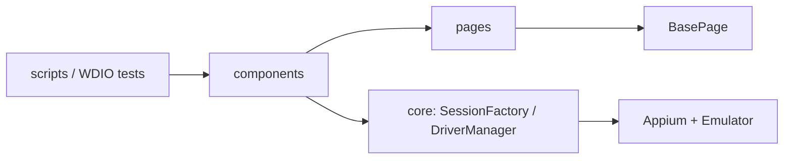

# Aungsha Mobile App Automation

**Appium 2 · WebdriverIO 9 · UiAutomator2 · Page Object Model (POM) + OOP**

End-to-end Android automation for the **Aungsha** app (`com.aungsha.app`) — login, project buy (SurjoPay / bKash), wallet credit, Fund withdraw, and receipt/certificate capture.

---

## Why this repo

| Goal | How we do it |
|------|----------------|
| Stable UI tests on Flutter Android | POM pages + accessibility `content-desc` locators |
| Reusable flows | Components (`BuyFlowComponent`, `WithdrawFlowComponent`) |
| Easy local runs | Thin `scripts/` CLIs + `npm` scripts |
| Safe secrets | `.env` only (never committed) |

---

## Tech stack

- **Appium 2** + **UiAutomator2**
- **WebdriverIO 9** + **Mocha**
- **Node.js** (Windows PowerShell friendly)
- Target: Android emulator (`Aungsha_Emu` / `emulator-5554`) or physical device

---

## Architecture



| Layer | Folder | Responsibility |
|-------|--------|----------------|
| CLI / specs | `scripts/`, `tests/` | Run entry points |
| Flows / infra | `services/` | Buy/Withdraw flows, Driver, Checkpoint, AppConfig |
| UI | `pages/` | Locators + taps only |

**Rule:** locators live in page classes only — never hardcode XPath in scripts.

---

## Project structure

```
├── pages/                   # Login, Home, Marketplace, Buy, Payment, Receipt, Withdraw
├── tests/                   # Mocha / WDIO specs (+ helpers)
├── services/                # Flows + DriverManager, SessionFactory, AppConfig, Checkpoint
├── scripts/                 # Canonical run CLIs
│   ├── tools/               # inspect-device, UI label helper
│   └── legacy/              # explore / dump helpers (optional)
├── apps/                    # Local APK / dumps / downloads (gitignored artifacts)
├── artifacts/               # Screenshots & logs (gitignored)
├── .cursor/skills/          # Agent skills for this repo
├── wdio.conf.js
├── package.json
├── .env.example
└── FLOW_DOCUMENTATION.md    # Detailed flow design notes
```

---

## Verified flows

```
Login
  ├─ Buy Shares → Cloud 9 → Pay
  │     ├─ Others → SurjoPay → mBANKING → Success → Receipt / Certificate
  │     └─ bKash → WEBVIEW (number / OTP / PIN) → Success
  └─ Home → Fund → Withdraw CTA → bKash → Amount → Submit
```

| Flow | Entry | Notes |
|------|--------|--------|
| Login | `npm run test:login` | Soft login if already authenticated |
| Buy (SurjoPay / mBANKING) | `npm run test:buy` | Cloud 9 → Others → WEBVIEW |
| Buy (bKash) | `npm run test:buy:bkash` | Forced WEBVIEW fill |
| Wallet + SurjoPay | `npm run test:buy:surjoypay:script` | `WALLET_AMOUNT` |
| Withdraw (Fund) | `npm run test:withdraw:script` | Home → Fund → Withdraw CTA |
| Receipt / Certificate | `npm run test:receipt` | When success UI is open |

---

## Quick start

### Prerequisites

- Node.js 18+
- Android SDK + `adb`
- Appium 2 (`uiautomator2` driver)
- Emulator AVD **Aungsha_Emu** (or set `DEVICE_UDID`)
- Aungsha app installed (`com.aungsha.app`)

### Install

```powershell
git clone https://github.com/imran2635/imran2635-Aungsha-Mobile-App-Automation-Test-Appium.git
cd imran2635-Aungsha-Mobile-App-Automation-Test-Appium

npm install
npx appium driver install uiautomator2
```

### Configure

```powershell
copy .env.example .env
# Edit .env — EMAIL, PASSWORD, DEVICE_UDID, payment sandbox keys
```

| Key | Purpose |
|-----|---------|
| `EMAIL` / `PASSWORD` | App login |
| `DEVICE_UDID` | e.g. `emulator-5554` |
| `MBANKING_NUMBER` / `MBANKING_PIN` | SurjoPay mBANKING |
| `BKASH_NUMBER` / `BKASH_OTP` / `BKASH_PIN` | bKash WEBVIEW |
| `WITHDRAW_BKASH_NUMBER` / `WITHDRAW_AMOUNT` | Fund withdraw |
| `WALLET_AMOUNT` | Wallet credit on Purchase Details |
| `SKIP_BUY` | `1` = withdraw without buy |
| `SKIP_RECEIPT` | `1` = skip receipt capture (better for chained flows) |
| `STEP_PAUSE_MS` | Emulator follow-along pause (e.g. `1800`) |

> Never commit `.env`, APKs, or real production credentials.

---

## Run

### Start Appium + emulator

```powershell
$env:ANDROID_HOME = "$env:LOCALAPPDATA\Android\Sdk"
$env:Path = "$env:ANDROID_HOME\platform-tools;$env:Path"
$env:DEVICE_UDID = "emulator-5554"

# Terminal 1
npm.cmd run appium

# Terminal 2 (if needed)
& "$env:LOCALAPPDATA\Android\Sdk\emulator\emulator.exe" -avd Aungsha_Emu
```

### Tests & scripts

```powershell
npm.cmd run test:login
npm.cmd run test:buy
npm.cmd run test:buy:bkash

npm.cmd run test:buy:script
npm.cmd run test:buy:bkash:script
npm.cmd run test:buy:surjoypay:script
npm.cmd run test:buy:bkash-fund:script

npm.cmd run test:withdraw:script
npm.cmd run test:receipt
npm.cmd run inspect:device
```

### Withdraw only (Fund → ৳500)

```powershell
$env:SKIP_BUY = "1"
$env:WITHDRAW_AMOUNT = "500"
$env:WITHDRAW_BKASH_NUMBER = "01772559986"
npm.cmd run test:withdraw:script
```

### Buy then withdraw

```powershell
Remove-Item Env:SKIP_BUY -ErrorAction SilentlyContinue
$env:BUY_METHOD = "surjoypay"
$env:SKIP_RECEIPT = "1"
$env:WITHDRAW_AMOUNT = "500"
npm.cmd run test:withdraw:script
```

---

## Design principles

1. **POM + OOP** — pages extend `BasePage` (`tap`, `tapAt`, `isVisible`, `show`)
2. **Reuse** — no duplicate methods; components orchestrate pages
3. **Forced coords** — last-resort fallback after locator miss (documented for 1080×2400)
4. **Session recover** — after WEBVIEW payments, UiAutomator2 may crash; flows recreate the session
5. **Visible demo** — `STEP_PAUSE_MS` slows steps so you can watch the emulator

---

## Troubleshooting

| Symptom | What to try |
|---------|-------------|
| `instrumentation process is not running` | Restart Appium; flows auto-recover session |
| Element not found | Dump UI → update page locators (see below) |
| Wrong “Withdraw” tap | Use Fund screen **ImageView** CTA, not title / bottom nav only |
| Multiple devices | Set `DEVICE_UDID` explicitly |

### Dump UI labels

```powershell
adb -s emulator-5554 shell uiautomator dump /sdcard/window_dump.xml
adb -s emulator-5554 pull /sdcard/window_dump.xml .\apps\downloads\ui-dump.xml
node .\scripts\tools\_ui-labels.js .\apps\downloads\ui-dump.xml
```

More detail: [`FLOW_DOCUMENTATION.md`](./FLOW_DOCUMENTATION.md)

---

## Cursor skills (optional)

This repo includes `.cursor/skills/` for agent-assisted work:

| Skill | Use |
|-------|-----|
| `/compet` | Full project context pack |
| `/appium-mobile` | Stack + run playbook |
| `/appium-locators` | Flutter locator strategy |
| `/appium-skills-index` | Full skill list |

---

## License

ISC — private test automation for Aungsha staging / QA use.

---

## Author

Maintained for **Aungsha** mobile QA automation.  
Repo: [imran2635-Aungsha-Mobile-App-Automation-Test-Appium](https://github.com/imran2635/imran2635-Aungsha-Mobile-App-Automation-Test-Appium)
